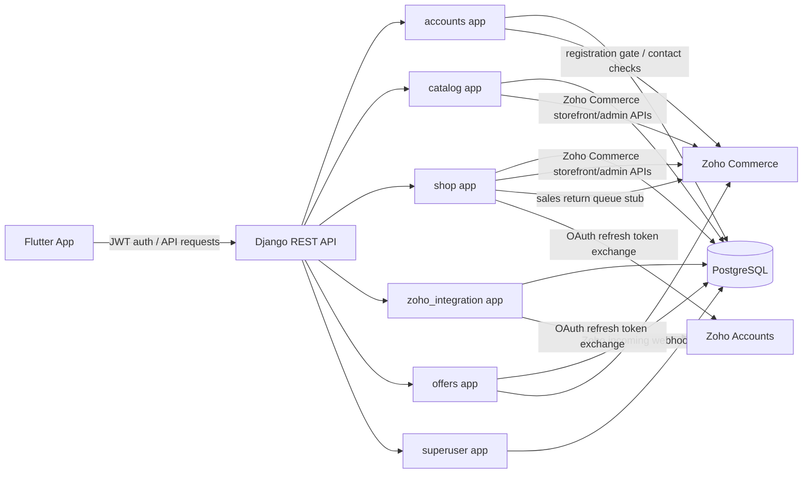
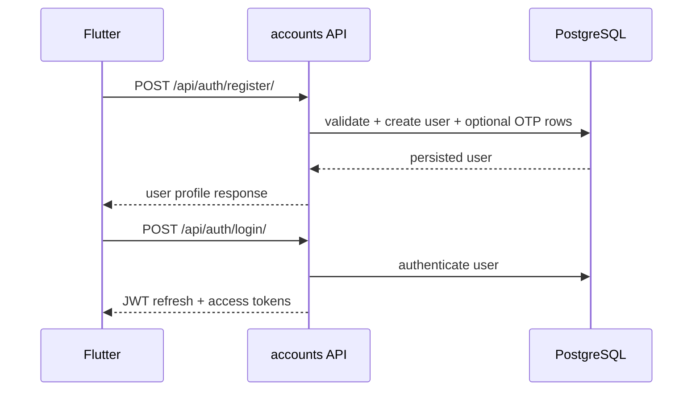
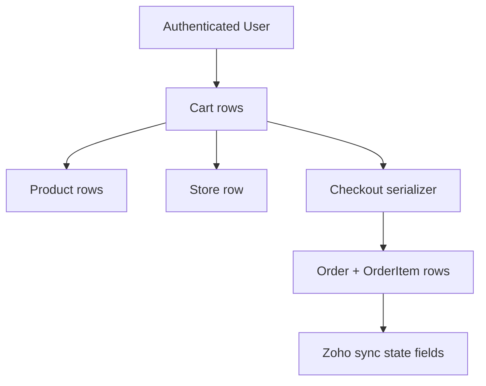
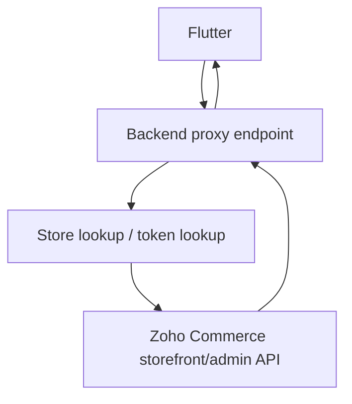
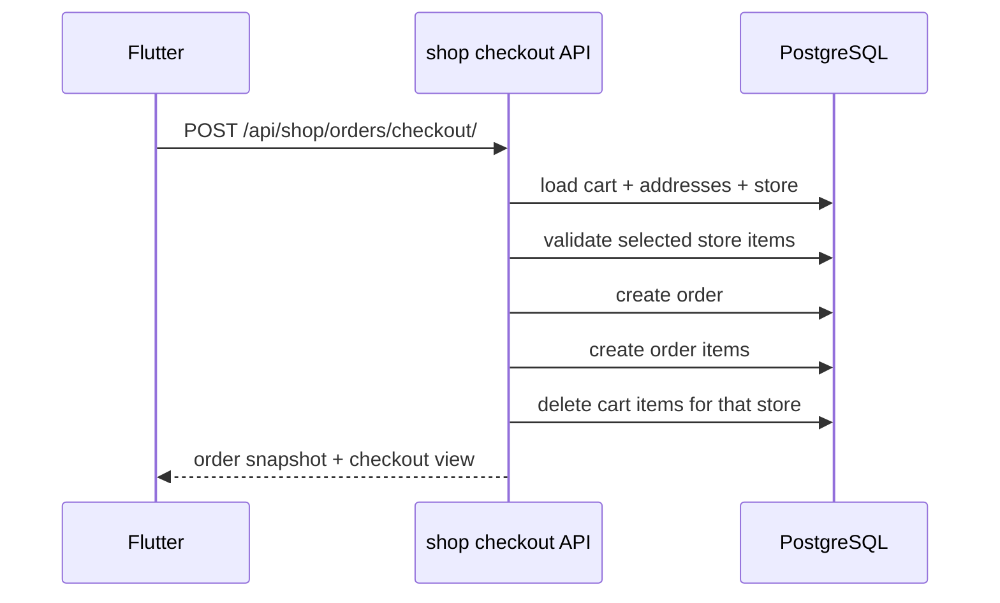
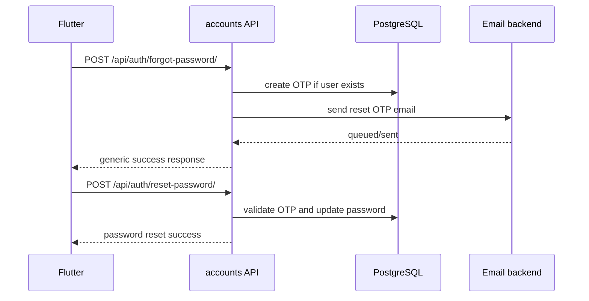

# AoneGT Master Technical README

This document is the technical source of truth for the backend repository currently available in this workspace. It is intentionally detailed and implementation-driven. It does not describe product marketing, and it does not invent behavior that is not present in code.

## 1. Project Overview

AoneGT is a multi-store eCommerce mobile platform with a Django + Django REST Framework backend and a Flutter frontend. The backend is responsible for:

- Custom authentication and user lifecycle management.
- Store and organization modeling.
- Product and category proxying from Zoho Commerce.
- Cart, wishlist, checkout, order, and return handling.
- Per-store OAuth token refresh and Zoho Commerce API access.
- Superuser-only coupon operations through Zoho incoming webhooks.
- Organization-to-store mapping and isolation.

The backend workspace confirms a production-oriented architecture, but several frontend and Zoho Books details are not present in this repository. Those gaps are explicitly marked as UNKNOWN where applicable.

Critical architectural rule:

- No request must assume a store context unless it is explicitly supplied or resolved from the authenticated request path/query/body.
- No cart, wishlist, order, address, or product operation may cross store boundaries unless the code explicitly aggregates by store for presentation only.

## 2. Architecture Diagram



## 3. Full Tech Stack

| Layer | Technology | Notes |
|---|---|---|
| Mobile frontend | Flutter | Frontend source is not present in this workspace. |
| Backend framework | Django 4.2.25 | Project settings indicate production deployment on Render. |
| API layer | Django REST Framework 3.15.2 | SimpleAPIView/generics are used heavily. |
| Auth | djangorestframework-simplejwt 5.5.0 | JWT access/refresh tokens are generated for mobile users and superusers. |
| Database | PostgreSQL | `dj-database-url` is used for environment-based configuration. |
| Email | Django email backend | Default is console backend in `.env.example`; SMTP supported via env vars. |
| Zoho API client | requests + urllib | Both are used. `requests` handles OAuth refresh and authenticated calls. `urllib` is used for some proxy helpers and contact checks. |
| Static file serving | WhiteNoise | Configured for production static assets. |
| CORS | django-cors-headers | Enabled globally in debug; origin-restricted in production. |
| WSGI server | gunicorn | Render start command uses gunicorn. |
| Media | Django media storage | Served under `/media/` in development. |

## 4. Full Project Directory Structure

This is the verified backend structure in the current workspace.

```text
AoneGT/
├── manage.py
├── requirements.txt
├── build.sh
├── render.yaml
├── README.md
├── .env.example
├── aonegt/
│   ├── settings.py
│   ├── urls.py
│   ├── asgi.py
│   └── wsgi.py
├── accounts/
│   ├── admin.py
│   ├── apps.py
│   ├── models.py
│   ├── serializers.py
│   ├── throttles.py
│   ├── urls.py
│   ├── views.py
│   ├── services/
│   │   ├── zoho_commerce_contact.py
│   │   ├── zoho_inventory_contact.py
│   │   └── zoho_registration_gate.py
│   └── migrations/
├── catalog/
│   ├── admin.py
│   ├── apps.py
│   ├── models.py
│   ├── serializers.py
│   ├── urls.py
│   ├── views.py
│   ├── services/
│   │   ├── zoho_commerce_products.py
│   │   ├── zoho_product_sync.py
│   │   └── zoho_sites.py
│   └── migrations/
├── shop/
│   ├── admin.py
│   ├── apps.py
│   ├── models.py
│   ├── serializers.py
│   ├── urls.py
│   ├── views.py
│   └── services/
│       ├── cart_zoho.py
│       ├── order_sync_state.py
│       ├── zoho_commerce.py
│       └── zoho_returns.py
├── offers/
│   ├── admin.py
│   ├── apps.py
│   ├── models.py
│   ├── serializers.py
│   ├── services.py
│   ├── tests.py
│   ├── urls.py
│   ├── views.py
│   └── migrations/
├── superuser/
│   ├── admin.py
│   ├── apps.py
│   ├── models.py
│   ├── tests.py
│   ├── urls.py
│   ├── views.py
│   └── migrations/
└── zoho_integration/
    ├── admin.py
    ├── apps.py
    ├── models.py
    ├── services.py
    ├── urls.py
    ├── views.py
    └── migrations/
```

## 5. Frontend Folder Structure

UNKNOWN in this workspace.

The backend is present, but the Flutter frontend source tree is not included here. Any frontend-specific folder structure, state management library, routing, and UI service wrapper names must be verified in the Flutter repository before being documented as facts.

Expected frontend responsibilities, based on backend contracts:

- JWT storage and refresh.
- Organization selection state.
- Store-scoped product/category browsing.
- Cart and wishlist state sync.
- Address management UI.
- Checkout and payment method selection.
- Password reset and OTP UI.

## 6. Backend Folder Structure

### 6.1 Core Project Package

- `aonegt/settings.py` contains global environment, database, REST framework, JWT, CORS, email, and Zoho settings.
- `aonegt/urls.py` mounts all app URL trees.
- `aonegt/asgi.py` and `aonegt/wsgi.py` are standard Django entrypoints.

### 6.2 Apps and Responsibilities

| App | Responsibility | Key Notes |
|---|---|---|
| `accounts` | Custom auth, profiles, password reset, OTP, account lifecycle | JWT is used for mobile auth. Zoho is only used for optional registration gating. |
| `catalog` | Store, banner, product browsing, Zoho proxy endpoints | Handles public store/category/product endpoints and admin CRUD for Store/Product/Banner. |
| `shop` | Cart, wishlist, addresses, checkout, orders, returns | Stores all customer-facing commerce state in PostgreSQL. |
| `zoho_integration` | Zoho multi-account OAuth, store listing, category/product proxy helpers | Contains direct Zoho token exchange and account-scoped API access. |
| `offers` | Superuser login, organizations, coupon webhooks | Uses Zoho incoming webhooks, not direct OAuth Commerce API calls. |
| `superuser` | Secret-based superuser bootstrap endpoint | Used to create a superuser via API secret header. |

## 7. Environment Variables

The verified environment variables come from `aonegt/settings.py` and `.env.example`.

| Variable | Purpose | Status |
|---|---|---|
| `DJANGO_SECRET_KEY` | Django secret | Required in production. |
| `DEBUG` | Debug flag | Defaults to `True` locally. |
| `ALLOWED_HOSTS` | Host allowlist | Comma-separated list. |
| `DB_NAME` / `DB_USER` / `DB_PASSWORD` / `DB_HOST` / `DB_PORT` | PostgreSQL connection | Used by `dj-database-url` config. |
| `DATABASE_URL` | Render connection string | Used automatically in production. |
| `EMAIL_BACKEND` | Mail backend | Defaults to console backend. |
| `EMAIL_HOST` / `EMAIL_PORT` / `EMAIL_HOST_USER` / `EMAIL_HOST_PASSWORD` / `EMAIL_USE_TLS` | SMTP configuration | Optional but required for real email delivery. |
| `DEFAULT_FROM_EMAIL` | Email sender | Used for OTP and password reset emails. |
| `FRONTEND_RESET_URL` | Password reset URL in email | Defaults to `aonegt://reset-password`. |
| `CHECKOUT_TRUST_CLIENT_SHIPPING` | Whether client may provide shipping amount | Defaults false. |
| `DEFAULT_SHIPPING_AMOUNT` | Server-side shipping amount | Used when client shipping is not trusted. |
| `REGISTER_REQUIRE_ZOHO_CONTACT` | Require Zoho contact/sales-order existence before registration | Optional gate. |
| `REGISTER_ZOHO_EMAIL_SOURCE` | `inventory` or `commerce_salesorders` source for registration gating | Defaults to `inventory`. |
| `REGISTER_REQUIRE_EMAIL_OTP` | Require signup OTP | Optional. |
| `ZOHO_API_BASE_HOST` | Zoho API host for Inventory contact checks | Defaults to `https://www.zohoapis.com`. |
| `ZOHO_INVENTORY_ORGANIZATION_ID` | Zoho Inventory org id | Required if Inventory registration gating is enabled. |
| `ZOHO_COMMERCE_ORGANIZATION_ID` | Zoho Commerce org id | Used by Commerce contact checks and proxy defaults. |
| `ZOHO_COMMERCE_BASE_URL` | Zoho Commerce base URL | Defaults to `https://commerce.zoho.com`. |
| `ZOHO_ACCOUNTS_URL` | Zoho Accounts token endpoint host | Defaults to `https://accounts.zoho.com`. |
| `ZOHO_STORE_DOMAIN` | Global store domain fallback | Used by storefront requests when no per-store domain exists. |
| `ZOHO_ORG_ID` | Global Zoho org fallback | Falls back to `ZOHO_COMMERCE_ORGANIZATION_ID`. |
| `ZOHO_CLIENT_ID` / `ZOHO_CLIENT_SECRET` / `ZOHO_REFRESH_TOKEN` | Global Zoho OAuth refresh credentials | Used by shop/catalog proxy helpers when store-level creds are absent. |
| `ZOHO_IMAGE_PLACEHOLDER_URL` | Placeholder image URL | Used when Zoho image resolution fails. |
| `SUPERUSER_API_SECRET` | Secret header for superuser bootstrap | Used by `/api/admin/create-superuser/`. |
| `CORS_ALLOWED_ORIGINS` | Production CORS list | Comma-separated origins. |

Missing from the codebase and therefore UNKNOWN as a verified backend requirement:

- Flutter-specific environment keys.
- Payment gateway API keys.
- Zoho Books credentials.

## 8. API Service Layer

### 8.1 Service Layer Overview

The backend does not use a single centralized service abstraction. Instead, service responsibilities are distributed by domain:

- `accounts/services/*` for registration-time Zoho email checks.
- `catalog/services/*` for store listing, category/product proxies, and sync helpers.
- `shop/services/*` for checkout, order sync state, and cart helpers.
- `zoho_integration/services.py` for multi-account OAuth and webhook-driven coupon operations.
- `offers/services.py` for coupon webhooks and superuser auth.

### 8.2 Why This Exists

This is a pragmatic service split that keeps external API code out of views while still allowing app-specific request orchestration in the view layer. The downside is that some behavior is duplicated between `catalog` and `shop` helper modules. That duplication is intentional in a few places to support different data-shaping requirements, but future edits should avoid diverging the same business rule in two places.

### 8.3 Critical Couplings

| Coupled Areas | Reason |
|---|---|
| `Store` ↔ Zoho org/domain/token fields | Local store rows can carry per-store Zoho credentials and headers. |
| `CartItem` ↔ `Product` ↔ `Store` | Cart lines are store-scoped and product-scoped. |
| `WishlistItem` ↔ `Product` ↔ `Store` | Wishlist is per-user and per-store. |
| `Order` ↔ `Store` ↔ `User` | Orders are protected and cannot cross store boundaries. |
| `ZohoCommerceAccount` ↔ multi-account shop/category/product listing | Account-scoped OAuth is used for multi-organization Zoho access. |

## 9. Authentication System

### 9.1 High-Level Design

Authentication for mobile users is fully custom. Zoho authentication is not used for mobile login.

Verified implementation details:

- Custom user model: `accounts.User`.
- Password hashing: Django built-in password hashing via `set_password()`.
- Tokens: SimpleJWT refresh and access tokens.
- Protected routes: `JWTAuthentication` + DRF permission classes.
- Profile ownership: bound to `request.user`.
- Password reset: OTP-based, stored in PostgreSQL.

### 9.2 User Model

`accounts.models.User` fields:

- `first_name`
- `last_name`
- `email` unique and used as username field
- `phone`
- `is_active`
- `is_staff`
- `created_at`

The authentication backend uses `AUTH_USER_MODEL = 'accounts.User'`.

### 9.3 OTP Models

- `PasswordResetOTP` stores password reset codes for existing users.
- `RegistrationOTP` stores signup verification codes before account creation.

Both store:

- OTP code
- `is_used`
- `created_at`
- `expires_at`

They auto-generate a 6-digit code when absent and expire after 10 minutes.

### 9.4 Auth Flows

#### Sign Up

1. Frontend submits `first_name`, `last_name`, `email`, `phone`, `password`, and optionally `registration_otp`.
2. `RegisterSerializer` validates uniqueness of email and required phone.
3. If `REGISTER_REQUIRE_ZOHO_CONTACT` is enabled, the email must exist in the configured Zoho source.
4. If `REGISTER_REQUIRE_EMAIL_OTP` is enabled, the code must exist, be unused, and not be expired in `RegistrationOTP`.
5. `User.objects.create_user()` hashes the password and creates the user.
6. Any consumed `RegistrationOTP` row is marked used.

#### Sign In

1. Frontend submits email and password.
2. `authenticate(username=email, password=password)` is used.
3. Inactive users are rejected.
4. `RefreshToken.for_user(user)` generates JWT refresh and access tokens.
5. Frontend stores both tokens and sends `Authorization: Bearer <access>` on protected calls.

#### Forgot Password

1. Frontend submits email.
2. Throttle scope `forgot_password` is applied via `ForgotPasswordRateThrottle`.
3. If a user exists, a `PasswordResetOTP` row is created.
4. An email with OTP and reset URL is sent.
5. The API returns a generic success response whether the account exists or not.

#### Verify Reset OTP

1. Frontend submits email and OTP.
2. Backend checks user existence and OTP validity.
3. If valid, returns success without changing the password.

#### Reset Password

1. Frontend submits email, OTP, new password, confirm password.
2. Backend validates matching passwords.
3. Backend verifies unused, unexpired OTP for that user.
4. Password is changed using `set_password()`.
5. OTP is marked used.

### 9.5 Token Handling

Configured JWT settings in code:

- Access token lifetime is set in `SIMPLE_JWT`.
- Refresh token lifetime is set in `SIMPLE_JWT`.
- Authorization header type is `Bearer`.

Important implementation note:

- `settings.py` defines `SIMPLE_JWT` twice. The later definition overrides the earlier one. The effective configuration in the runtime settings is the second block, which sets both access and refresh token lifetimes to 5 days.

### 9.6 Middleware / Guards

Verified behavior:

- DRF defaults to `AllowAny`, so each protected endpoint must set `IsAuthenticated` or `IsAdminUser` explicitly.
- `ProfileAPIView`, cart, wishlist, address, checkout, and order endpoints are protected.
- Admin store/banners endpoints use `IsAdminUser`.
- No custom authentication middleware is present.

### 9.7 Auth APIs

Base path: `/api/auth/`

| Method | Path | Purpose | Auth |
|---|---|---|---|
| POST | `register/` | Create account | Public |
| POST | `check-email/` | Check if email exists | Public |
| POST | `check-zoho-contact/` | Optional Zoho eligibility check for registration | Public |
| POST | `request-registration-code/` | Send signup OTP | Public |
| POST | `login/` | Obtain JWT pair | Public |
| POST | `forgot-password/` | Send reset OTP | Public |
| POST | `verify-reset-otp/` | Verify reset OTP without changing password | Public |
| POST | `reset-password/` | Set new password using OTP | Public |
| GET | `profile/` | Retrieve profile | JWT |
| PATCH | `profile/` | Update profile | JWT |
| POST | `account/deactivate/` | Mark account inactive | JWT |
| POST | `account/delete/` | Delete or anonymize account | JWT |

### 9.8 Request/Response Example

```json
POST /api/auth/login/
{
  "email": "amina@example.com",
  "password": "Test@1234"
}
```

```json
{
  "user": {
    "id": 1,
    "first_name": "Amina",
    "last_name": "Ali",
    "email": "amina@example.com"
  },
  "tokens": {
    "refresh": "<refresh_token>",
    "access": "<access_token>"
  }
}
```

## 10. Organization Management

### 10.1 What Exists in Code

There are two parallel concepts:

1. `catalog.Store`
2. `zoho_integration.Organization`

They are not the same thing.

#### `catalog.Store`

Used for:

- Public storefront browsing.
- Per-store Zoho Commerce credentials.
- Per-store product mappings.
- Checkout and cart ownership context.

Fields include:

- `name`, `slug`, `contact_email`, `category`, `description`, `logo_url`
- `zoho_org_id`, `zoho_store_domain`
- `client_id`, `client_secret`, `refresh_token`, `access_token`, `token_expiry`
- `is_active`, `sort_order`

#### `zoho_integration.Organization`

Used for:

- Coupon/webhook management.
- Superuser organization listing.

Fields include:

- `name`
- `image`
- `org_id`
- `is_active`

### 10.2 Organization Selection Flow

Verified backend behavior:

- The public dashboard store list comes from `catalog.Store.objects.filter(is_active=True)`.
- When a store is selected, the frontend is expected to carry that store context into store-scoped requests through the `store_id` query parameter or store-related body fields.
- For Zoho multi-account endpoints, the frontend may choose an organization id and use `zoho_integration.ZohoCommerceAccount` plus organization id directly.

### 10.3 Isolation Rules

- Cart and wishlist rows are user-owned and also store-linked at item level.
- Orders are user-owned and store-linked and cannot be reassigned across stores.
- Checkout always resolves a single store id and only consumes cart items for that store.
- Public catalog endpoints always filter by active store or product/store relation.

### 10.4 What is NOT Verified

The prompt requested a dynamic dashboard with organization switching and stored organization state in Flutter. The backend code does not contain the Flutter implementation, so the exact frontend state container, persistence mechanism, and switching UI are UNKNOWN here.

## 11. Zoho Commerce Integration

### 11.1 Integration Modes Present in Code

There are three distinct Zoho patterns in this backend:

1. Direct storefront/admin API access with refresh-token OAuth.
2. Direct proxying of Zoho Commerce responses for mobile clients.
3. Incoming webhook-based coupon management for superusers.

### 11.2 Direct OAuth Refresh Flow

Implemented in `shop.services.zoho_commerce.ZohoCommerceService` and `zoho_integration.services.ZohoCommerceService`.

Process:

1. Use refresh token, client id, and client secret.
2. Call Zoho Accounts token endpoint.
3. Receive access token and expiration.
4. Save access token and expiry on the local Store row when per-store credentials are used.
5. Use token in Commerce requests.

### 11.3 Store-Level vs Global Credentials

The code supports both:

- Global env-based credentials.
- Per-store credentials saved on `catalog.Store`.

When a `Store` has a non-empty `access_token` and unexpired `token_expiry`, some helpers reuse it.
When store-level credentials are absent, code falls back to environment variables.

### 11.4 Verified Zoho Commerce API Usage

#### Public Storefront APIs

- `GET /storefront/api/v1/products`
- `GET /storefront/api/v1/products/{product_id}`

These are used for public product listings and product details.

#### Admin Store APIs

- `GET /store/api/v1/products`
- `GET /store/api/v1/products/{product_id}`
- `GET /store/api/v1/categories`
- `GET /store/api/v1/categories/{category_id}`
- `GET /store/api/v1/salesorders` for registration email checks in Commerce mode.

#### Sites Index API

- `GET /zs-site/api/v1/index/sites`

Used to list Zoho shops/organizations for multi-account flows.

### 11.5 Category APIs

Documented code paths:

- `catalog.views.ZohoCommerceShopListAPIView`
- `catalog.views.ZohoCommerceShopProductListAPIView`
- `zoho_integration.views.MultiAccountZohoCategoryListAPIView`
- `zoho_integration.views.MultiAccountZohoCategoryListQueryAPIView`
- `zoho_integration.views.MultiAccountZohoCategorySearchAPIView`
- `zoho_integration.views.MultiAccountZohoCategoryImageProxyAPIView`
- `zoho_integration.views.MultiAccountZohoCategoryImageQueryAPIView`

Observed behavior:

- Categories are shaped into a mobile-friendly summary.
- Top-level categories are chosen using depth/parent heuristics.
- Category images are resolved from direct image URLs, document attachments, descendant categories, or a fallback placeholder.

### 11.6 Product APIs

Documented code paths:

- `catalog.views.ZohoCommerceProductsProxyAPIView`
- `catalog.views.ZohoCommerceProductDetailProxyAPIView`
- `shop.views.ZohoProductListAPIView`
- `shop.views.ZohoProductDetailAPIView`
- `shop.views.ZohoProductImageProxyAPIView`
- `zoho_integration.views.MultiAccountZohoProductListAPIView`
- `zoho_integration.views.MultiAccountZohoProductListQueryAPIView`
- `zoho_integration.views.MultiAccountZohoProductSearchAPIView`
- `zoho_integration.views.MultiAccountZohoProductDetailQueryAPIView`
- `zoho_integration.views.MultiAccountZohoProductImageProxyAPIView`

Observed behavior:

- Product list results are normalized into `product_id`, `name`, `sku`, `price`, and `image_url`.
- If Zoho returns only image filenames or non-URL values, the code converts them to proxy URLs or placeholder images.
- If storefront detail fails with 404/405, code falls back to authenticated admin product detail.

### 11.7 Search APIs

Search exists in two forms:

- Local store product search through `catalog.StoreProductListAPIView` using `search` query param.
- Zoho multi-account product/category search through `zoho_integration` query endpoints.

There is no generic global search engine in this backend beyond these explicit query filters.

### 11.8 Checkout-Related Zoho APIs

The backend defines checkout/order lifecycle models and a status machine, but a concrete Zoho Books invoice creation implementation was not located in the scanned workspace.

Verified adjacent Zoho checkout behavior:

- `shop.models.Order` tracks `zoho_checkout_id`, `zoho_salesorder_id`, `zoho_sync_error`, `zoho_synced_at`.
- `shop.services.order_sync_state.apply_order_sync_transition()` manages transitions.
- `shop.services.zoho_returns.enqueue_push_return_to_zoho()` is a stub.

Therefore, the exact invoice-generation request flow is UNKNOWN in this repository and must be verified in a different codebase or future branch if it exists.

### 11.9 Token Refresh Logic

Verified behaviors:

- Token refresh is done using Zoho Accounts `oauth/v2/token` refresh token exchange.
- Per-store refresh can update `Store.access_token` and `Store.token_expiry`.
- `zoho_integration.services` caches tokens in memory for a short TTL and retries network failures.
- Some helper functions retry once on HTTP 401 by clearing token cache and refreshing again.

### 11.10 Error Handling and Retry Handling

Direct code behaviors:

- `requests.RequestException` is caught and rethrown as domain-specific errors.
- `HTTPError` and `URLError` are handled in urllib-based code.
- Network failures are wrapped with human-readable context.
- Token endpoint parse failures are surfaced as invalid JSON errors.
- Product/category image proxy endpoints fall back to placeholders or 404 rather than failing catastrophically.

### 11.11 What Must Never Be Rewritten Blindly

- The per-store `zoho_org_id` / `zoho_store_domain` resolution order.
- The image fallback chain in product/category proxy endpoints.
- The `Store`-scoped cart product upsert logic.
- The duplicate fallback from storefront detail to admin detail for product retrieval.

These are intentionally defensive because Zoho payloads are inconsistent across stores.

## 12. Zoho Books Integration

UNKNOWN / not verified in this workspace.

No direct Zoho Books API client, model, or service file was found in the scanned backend code. The current code contains order bookkeeping fields and references that could support invoice synchronization in the future, but an actual Zoho Books integration implementation is not present in the verified repository contents.

What is verified instead:

- `shop.models.Order` stores Zoho checkout and sales order ids.
- The code does not expose a Books invoice model or Books API service.
- Any claim that invoice generation is already implemented would be an assumption and is not made here.

## 13. Database Schema

### 13.1 Auth Tables

#### `accounts_user`

- `id`
- `first_name`
- `last_name`
- `email` unique
- `phone`
- `password`
- `is_active`
- `is_staff`
- `created_at`

#### `accounts_passwordresetotp`

- `user_id`
- `otp_code`
- `is_used`
- `created_at`
- `expires_at`

#### `accounts_registrationotp`

- `email`
- `otp_code`
- `is_used`
- `created_at`
- `expires_at`

### 13.2 Catalog Tables

#### `catalog_store`

- `name`
- `slug` unique
- `contact_email`
- `category`
- `description`
- `logo_url`
- `is_active`
- `zoho_org_id`
- `zoho_store_domain`
- `client_id`
- `client_secret`
- `refresh_token`
- `access_token`
- `token_expiry`
- `created_at`
- `sort_order`

#### `catalog_banner`

- `store_id` nullable FK
- `title`
- `subtitle`
- `image_url`
- `link_url`
- `sort_order`
- `is_active`
- `created_at`
- `updated_at`

#### `catalog_product`

- `store_id` FK
- `name`
- `slug`
- `category`
- `sku`
- `description`
- `price`
- `compare_at_price`
- `currency`
- `image_url`
- `is_active`
- `zoho_product_id`
- `created_at`
- `updated_at`

Constraint:

- Unique store + slug constraint.

### 13.3 Shop Tables

#### `shop_useraddress`

- `user_id`
- `full_name`
- `phone_number`
- `address`
- `city`
- `state`
- `address_type`
- `is_default`
- `created_at`
- `updated_at`

#### `shop_cart`

- `user_id` unique
- `updated_at`

#### `shop_cartitem`

- `cart_id`
- `store_id`
- `product_id`
- `quantity`

Constraint:

- Unique cart + product constraint.

#### `shop_wishlistitem`

- `user_id`
- `store_id`
- `product_id`
- `created_at`

Constraint:

- Unique user + product constraint.

#### `shop_order`

- `user_id` protected FK
- `store_id` protected FK
- `status`
- `currency`
- `payment_method`
- `subtotal`
- `vat_percent`
- `vat_amount`
- `shipping_amount`
- `total`
- Shipping fields
- Billing fields
- `zoho_checkout_id`
- `zoho_salesorder_id`
- `zoho_sync_error`
- `zoho_synced_at`
- `created_at`
- `updated_at`

#### `shop_orderitem`

- `order_id`
- `product_id` nullable SET_NULL
- `product_name`
- `sku`
- `unit_price`
- `quantity`
- `line_total`
- `zoho_line_item_id`

#### `shop_orderreturn`

- `order_id`
- `user_id`
- `status`
- `zoho_salesreturn_id`
- `note`
- `created_at`
- `updated_at`

#### `shop_orderreturnline`

- `order_return_id`
- `order_item_id`
- `quantity`

### 13.4 Zoho Integration Tables

#### `zoho_integration_zohocommerceaccount`

- `name`
- `email` unique
- `organization_id`
- `accounts_url`
- `commerce_base_url`
- `client_id`
- `client_secret`
- `refresh_token`
- `is_active`
- `created_at`

#### `zoho_integration_organization`

- `name`
- `image`
- `org_id` unique
- `is_active`
- `created_at`
- `updated_at`

#### `zoho_integration_webhookconfig`

- `organization_id`
- `webhook_type`
- `webhook_url`
- `is_active`
- `created_at`

## 14. Models Explanation

### 14.1 `catalog.Store`

This is the most important store-scoping model in the backend.

Why it exists:

- It binds app-visible storefront identity to Zoho Commerce organization and storefront domain.
- It stores per-store OAuth credentials where available.
- It allows the backend to serve multiple independent storefronts without mixing data.

If modified incorrectly:

- Storefront requests may point to the wrong Zoho org.
- Cart and order mappings can leak across organizations.
- Product images may resolve against the wrong domain.

### 14.2 `catalog.Product`

Why it exists:

- It mirrors sellable items locally so cart, wishlist, order, and related-product flows can operate without depending on live Zoho calls for every action.

Important behavior:

- `zoho_product_id` is the stable external mapping key.
- The same local product row is reused and updated as Zoho payloads change.

### 14.3 `shop.Cart` and `shop.CartItem`

Why they exist:

- Cart is persisted per authenticated user.
- Cart items are attached to products and stores so the UI can aggregate multi-store content while checkout remains store-specific.

Important behavior:

- One cart per user.
- One cart item row per product in a cart.
- Quantity increments merge into the existing row.

### 14.4 `shop.WishlistItem`

Why it exists:

- Wishlists are per user and per product.
- Store scope is preserved because the same external product id should not be assumed valid across organizations.

### 14.5 `shop.Order` and order return models

Why they exist:

- `Order` persists the authoritative checkout snapshot.
- Returns are tracked separately so returnable quantities can be enforced against active returns.

Important behavior:

- `Order.user` and `Order.store` are protected to preserve history.
- If a user deletes an account with historical orders, code anonymizes rather than deleting protected order rows.

### 14.6 `accounts.PasswordResetOTP` and `accounts.RegistrationOTP`

Why they exist:

- To separate password-reset and registration verification state.
- To keep OTP validity in the database rather than in memory.

### 14.7 `zoho_integration.ZohoCommerceAccount`

Why it exists:

- It supports multiple Zoho Commerce accounts, each with their own OAuth refresh token and base URL.
- It is the mechanism behind multi-account Zoho site/category/product endpoints.

### 14.8 `offers.Organization` and `offers.WebhookConfig`

Why they exist:

- They store per-organization webhook endpoints for coupon operations.
- Django sends webhooks to Zoho rather than calling coupon endpoints directly in code.

## 15. API Endpoints

### 15.1 URL Mounts

| Prefix | App |
|---|---|
| `/api/auth/` | `accounts.urls` |
| `/api/catalog/` | `catalog.urls` |
| `/api/shop/` | `shop.urls` |
| `/zoho/` | `zoho_integration.urls` |
| `/api/offers/` | `offers.urls` |
| `/api/admin/` | `superuser.urls` |

### 15.2 Catalog Endpoints

| Method | Path | Purpose |
|---|---|---|
| GET | `/api/catalog/banners/` | Public banners, optionally filtered by `store_id` |
| GET | `/api/catalog/stores/` | Active store list |
| GET | `/api/catalog/stores/{store_id}/products/` | Store product list with search |
| GET | `/api/catalog/stores/{store_id}/products/{pk}/` | Store product detail |
| GET | `/api/catalog/stores/{store_id}/products/{pk}/related/` | Related products |
| GET | `/api/catalog/zoho/shops/` | Zoho shop list from accounts |
| GET | `/api/catalog/zoho/shops/{shop_id}/products/` | Products for selected shop |
| GET | `/api/catalog/zoho-commerce/products/` | Raw Zoho Commerce product proxy |
| GET | `/api/catalog/zoho-commerce/products/{product_id}/` | Raw Zoho Commerce product detail proxy |
| POST/GET/PATCH/DELETE | `/api/catalog/admin/...` | Staff-only store/product/banner CRUD |

### 15.3 Shop Endpoints

| Method | Path | Purpose |
|---|---|---|
| GET/POST | `/api/shop/addresses/` | Address list/create |
| GET/PATCH/DELETE | `/api/shop/addresses/{pk}/` | Address detail |
| GET/POST | `/api/shop/wishlist/` | Wishlist list/create |
| GET/DELETE | `/api/shop/wishlist/item/` | Wishlist item detail/delete by query param |
| POST | `/api/shop/wishlist/move-to-cart/` | Move wishlist item to cart |
| GET | `/api/shop/cart/` | Full cart view |
| GET | `/api/shop/cart/summary/` | Lightweight cart summary |
| DELETE | `/api/shop/cart/clear/` | Clear cart |
| GET/PATCH/DELETE/POST | `/api/shop/cart/items/` | Cart item detail/update/remove/add from Zoho |
| POST | `/api/shop/orders/checkout/` | Checkout and order creation |
| GET | `/api/shop/orders/` | Order list |
| GET | `/api/shop/orders/{pk}/` | Order detail |
| GET/POST | `/api/shop/orders/{pk}/returns/` | Returns list/create |
| POST | `/api/shop/orders/reorder/` | Recreate cart from prior order |
| GET | `/api/shop/zoho-products/` | Storefront product list |
| GET | `/api/shop/zoho-products/{product_id}/` | Storefront product detail |
| GET | `/api/shop/zoho-products/{product_id}/image/` | Product image redirect |

### 15.4 Offers Endpoints

| Method | Path | Purpose |
|---|---|---|
| POST | `/api/offers/superuser-login/` | Superuser login |
| GET | `/api/offers/organizations/` | Active organizations for admin coupon work |
| GET | `/api/offers/organizations/{org_id}/coupons/` | List coupons via webhook |
| POST | `/api/offers/organizations/{org_id}/coupons/create/` | Create coupon via webhook |
| DELETE | `/api/offers/organizations/{org_id}/coupons/delete/` | Delete coupon via webhook |
| GET | `/api/offers/organizations/{org_id}/coupons/{coupon_id}/` | Fetch coupon details via webhook |
| PUT | `/api/offers/organizations/{org_id}/coupons/{coupon_id}/update/` | Update coupon via webhook |

### 15.5 Zoho Integration Endpoints

| Method | Path | Purpose |
|---|---|---|
| GET | `/zoho/callback/` | OAuth callback for Zoho accounts |
| GET | `/zoho/multi/stores/` | List all Zoho shops for active accounts |
| GET | `/zoho/multi/products/` | Multi-account product listing by query params |
| GET | `/zoho/multi/products/search/` | Multi-account product search |
| GET | `/zoho/multi/product-detail/` | Multi-account product detail |
| GET | `/zoho/multi/categories/` | Multi-account category listing by query params |
| GET | `/zoho/multi/categories/search/` | Multi-account category search |
| GET | `/zoho/multi/categories/image/` | Multi-account category image redirect |
| GET | `/zoho/multi/accounts/{account_id}/products/{organization_id}/` | Multi-account product list by path |
| GET | `/zoho/multi/accounts/{account_id}/categories/{organization_id}/{category_id}/image/` | Category image redirect |

### 15.6 Admin Bootstrap Endpoint

| Method | Path | Purpose |
|---|---|---|
| POST | `/api/admin/create-superuser/` | Create a superuser with `X-ADMIN-SECRET` header |

## 16. Request/Response Examples

### 16.1 Registration

```json
POST /api/auth/register/
{
  "first_name": "Amina",
  "last_name": "Ali",
  "email": "amina@example.com",
  "phone": "+971500000000",
  "password": "Test@1234"
}
```

```json
{
  "message": "Account created successfully.",
  "user": {
    "id": 1,
    "first_name": "Amina",
    "last_name": "Ali",
    "email": "amina@example.com",
    "phone": "+971500000000",
    "is_active": true,
    "created_at": "2026-03-27T10:00:00Z"
  }
}
```

### 16.2 Forgot Password

```json
POST /api/auth/forgot-password/
{
  "email": "amina@example.com"
}
```

```json
{
  "message": "If an account exists for this email, a password reset code has been sent.",
  "email": "amina@example.com"
}
```

### 16.3 Cart Detail

```json
GET /api/shop/cart/
```

The response includes:

- `cart_id`
- flat `items`
- store-grouped `store_groups`
- cart `subtotal`
- per-item and per-group subtotals

### 16.4 Checkout

```json
POST /api/shop/orders/checkout/
{
  "store_id": 1,
  "address_id": 4,
  "payment_method": "cash_on_delivery",
  "vat_percent": "5.00"
}
```

Response shape includes:

- `order`
- `checkout_view.delivery_address`
- `checkout_view.payment_methods`
- `checkout_view.order_summary`

## 17. State Management

UNKNOWN in this workspace for Flutter implementation details.

What the backend requires the frontend to maintain:

- JWT access and refresh tokens.
- Selected store context.
- Selected address context.
- Cart state by store.
- Wishlist state by store.
- Checkout form state.
- OTP entry state.

Frontend must not assume the backend will infer store context automatically from the user unless a route or request explicitly includes it.

## 18. Cart Logic

### 18.1 Data Model Behavior

- A user has one cart.
- A cart can contain items from multiple stores.
- Each line item stores `store_id` and `product_id`.

### 18.2 Add-to-Cart Flows

There are two supported flows:

1. Direct cart modification via existing local product rows.
2. Add-to-cart from Zoho multi-account product selection using `zoho_account_id`, `organization_id`, `zoho_product_id`, and optional `primary_domain`.

### 18.3 Product Upsert Before Cart Add

Before inserting a cart line, the backend tries to ensure the local `Product` row is complete enough to be saleable:

- It fetches fresh Zoho payloads when possible.
- It backfills name, SKU, price, category, description, and image.
- It refuses to add a product if it cannot resolve a meaningful non-fallback name and a positive price.

This is a safety gate. It exists to prevent carting incomplete Zoho rows.

### 18.4 Cart Aggregation Behavior

The cart detail serializer returns:

- A flat line list.
- Grouped `store_groups` for store-by-store UI rendering.
- `subtotal` computed across all lines.

This grouping is display-only. It does not create multiple carts.

### 18.5 Cart Summary Behavior

`/api/shop/cart/summary/` returns:

- `products_count`: number of distinct lines.
- `items_count`: sum of quantities.
- `subtotal`: computed total.

### 18.6 Reorder Flow

`POST /api/shop/orders/reorder/` copies items from a previous order into the cart.

Modes:

- `merge`: keep existing cart items and add quantities.
- `replace`: clear cart first.

## 19. Wishlist Logic

### 19.1 Behavior

- Wishlists are per user and per product.
- A wishlist item is also linked to a store.
- Duplicate entries for the same user/product are prevented.

### 19.2 Add-to-Wishlist Flow

The backend requires a fully resolved product from Zoho account flow before persisting the wishlist item. This is stricter than the cart path because wishlist items are expected to hold a stable local product snapshot.

### 19.3 Move-to-Cart Flow

The move-to-cart endpoint:

- Locks or creates the cart.
- Adds or increments the matching cart item.
- Optionally deletes the wishlist item.

This is transaction-safe and prevents partial updates.

## 20. Checkout Logic

### 20.1 Checkout Validation

`CheckoutSerializer` enforces:

- A valid active store id.
- A cart exists for the authenticated user.
- The cart contains at least one item for the selected store.
- Either an `address_id` or a full shipping address payload exists.
- Billing address fields are required when billing is not the same as shipping.

### 20.2 Store-Scoped Checkout

Checkout only consumes cart items belonging to the selected store.

If the cart contains items for other stores, they remain in the cart and are not part of the order.

### 20.3 Shipping Source

Shipping amount behavior is controlled by config:

- If `CHECKOUT_TRUST_CLIENT_SHIPPING` is true, the client-provided shipping amount is used.
- Otherwise `DEFAULT_SHIPPING_AMOUNT` is used.

This is a deliberate anti-tamper rule.

### 20.4 Checkout Snapshot

On order creation, the backend stores:

- subtotal
- VAT percent
- VAT amount
- shipping amount
- total
- shipping and billing fields
- payment method

Then it copies line items into `OrderItem` rows and deletes the corresponding cart items.

### 20.5 Post-Checkout Response

The response returns both:

- Serialized order data.
- A `checkout_view` structure for the frontend UI.

This is not a generic REST pattern; it is a mobile-optimized response contract.

## 21. Pricing Logic

### 21.1 Current Formula

Verified checkout calculation:

$$
total = subtotal + vat\_amount + shipping\_amount
$$

Where:

$$
vat\_amount = \frac{subtotal \times vat\_percent}{100}
$$

### 21.2 Subtotal Calculation

Subtotal is computed by summing each cart line subtotal:

$$
line\_subtotal = product.price \times quantity
$$

The system quantizes to 2 decimal places using `Decimal('0.01')`.

### 21.3 Compare-At Price

`compare_at_price` is present on `Product` and may be used by the UI for strike-through pricing, but it is not part of the checkout total logic.

### 21.4 Coupon Insert Point

If coupons are added later, the correct place for pricing mutation is before `Order.objects.create()` inside checkout flow, after cart items are validated but before VAT and total are committed.

Do not apply coupon reductions after order persistence unless the invoice/Zoho sync layer is also aware of the discounted totals.

## 22. Tax Logic

### 22.1 Current Behavior

- VAT percent is client-provided with a default of `5.00`.
- VAT amount is calculated server-side from the selected subtotal.
- VAT is persisted on the `Order` row.

### 22.2 Risk

If client-side code modifies VAT percent without backend validation, totals can drift.

### 22.3 Recommendation for Future Changes

If tax rules become more complex, move tax determination into a server-side pricing service, not into Flutter.

## 23. Address Management

### 23.1 Behavior

Addresses are saved per user and ordered by:

1. Default address first.
2. Most recently updated.
3. Most recently created.

### 23.2 Validation

Required fields are normalized and trimmed:

- full name
- phone number
- address
- city

### 23.3 Default Address Behavior

Only one default address should exist per user. When a new address is created or updated as default, existing default addresses for that user are unset.

### 23.4 Checkout Integration

If `address_id` is provided, checkout uses that address for shipping fields.
If not, it falls back to the user’s default address.
If no default exists, the frontend must submit the full shipping address fields.

## 24. Payment Flow

### 24.1 Implemented Payment Methods

`Order.PaymentMethod` includes:

- `geidea`
- `credit_debit_card`
- `card_on_delivery`
- `cash_on_delivery`
- `pay_by_link`

### 24.2 Verified Runtime Behavior

Only cash-on-delivery is clearly implemented as a completed end-to-end flow in the scanned checkout code. Other methods exist in the model but their gateway integrations are UNKNOWN in this workspace.

### 24.3 Checkout Response

The checkout response includes the selected payment method label and a single-item list of payment methods containing the chosen method.

### 24.4 Unknowns

- Geidea gateway integration.
- Card gateway integration.
- Pay-by-link flow.

These are not verified in the backend code scanned here.

## 25. Invoice Flow

### 25.1 What Exists

The order model tracks Zoho sync ids and sync status fields:

- `zoho_checkout_id`
- `zoho_salesorder_id`
- `zoho_sync_error`
- `zoho_synced_at`

### 25.2 What Is Missing

No concrete Zoho Books invoice generation service or view was found in this workspace.

### 25.3 Verified Adjacent Flow

Order status transitions are managed by `shop.services.order_sync_state`:

- `pending_zoho_sync`
- `synced`
- `sync_failed`
- `cancelled`

This is the closest verified sync lifecycle in the codebase.

### 25.4 Required Future Verification

If invoice generation exists elsewhere, developers must verify:

- Which order status triggers it.
- Whether it depends on Zoho sales orders or Zoho Books invoices.
- Which API stores the invoice id.
- Whether invoice totals are derived from pre- or post-coupon totals.

## 26. Error Handling

### 26.1 API Error Patterns

The code uses consistent JSON error payloads, typically with either:

- `detail`
- `message`
- `error`

### 26.2 Validation Errors

Serializer validation is used for:

- Email format and uniqueness.
- OTP length and expiry.
- Phone requiredness.
- Cart and checkout constraints.
- Coupon request shape.

### 26.3 Network Errors

Zoho request failures are wrapped into domain-specific exceptions and surfaced as 5xx responses or webhook errors.

### 26.4 Security-Safe Generic Responses

Password reset and registration OTP flows use generic success messages to reduce account enumeration.

### 26.5 Transaction Safety

Cart, wishlist, checkout, and delete-account flows use transactions where state must not partially persist.

## 27. Token Refresh Handling

### 27.1 JWT for Mobile Users

The mobile app gets JWT refresh/access tokens from the login endpoint.
There is no backend refresh endpoint implemented in the scanned auth URLs, so the frontend must rely on standard SimpleJWT handling if refresh views are added elsewhere. If not, this is an extension point that must be verified.

### 27.2 Zoho Token Refresh

There are two token refresh implementations:

1. Global env-based refresh in `shop.services.zoho_commerce.ZohoCommerceService.refresh_access_token()`.
2. Account-scoped refresh in `zoho_integration.services.get_zoho_access_token()` and related helpers.

### 27.3 Caching

`zoho_integration.services` caches access tokens in memory with a safety window before expiry.

### 27.4 Store Token Persistence

If a `Store` has refresh credentials, the refreshed access token and expiry are written back to the row.

## 28. Security Considerations

### 28.1 Data Isolation

The most important security requirement is organization isolation.

Mitigations present in code:

- Store-scoped queries.
- User-scoped cart, wishlist, address, and order queries.
- Protected order and user relations.

### 28.2 Credential Handling

Zoho refresh tokens and client secrets are stored either in env vars or in `Store` / `ZohoCommerceAccount` rows. This means database access is sensitive and must be controlled.

### 28.3 OTP Safety

OTP data expires after 10 minutes and is marked used after consumption.

### 28.4 Enumeration Protection

Forgot password and registration code flows avoid revealing whether an email exists.

### 28.5 Account Deletion Safety

Users with orders are anonymized instead of fully deleted because order rows are protected.

## 29. Deployment Architecture

### 29.1 Render Configuration

`render.yaml` defines:

- One PostgreSQL database.
- One web service.
- `build.sh` as the build command.
- `gunicorn aonegt.wsgi:application` as the start command.

### 29.2 Build Script

`build.sh` performs:

1. Package installation.
2. Static collection.
3. Migrations.

### 29.3 Production Security

When `DEBUG=False`, the code enables:

- SSL redirect.
- Secure cookies.
- Proxy SSL header trust.

## 30. Scalability Design

### 30.1 Current Scalability Characteristics

The backend is designed to support multiple organizations with a shared codebase and isolated data rows.

### 30.2 Existing Scaling Constraints

- Some Zoho token fetches are cached only in memory, which is process-local.
- Some flows still depend on live Zoho calls during product image resolution.
- Product and category normalization logic is duplicated in places.

### 30.3 Good Extension Strategy

- Add service-layer wrappers rather than putting more external API logic into views.
- Keep store-scoped state in `catalog.Store`.
- Keep user-specific commerce state in `shop` models.
- Prefer local persistence for any data needed by checkout or offline UI.

## 31. Known Technical Debt

1. `SIMPLE_JWT` is defined twice in settings. The second block wins.
2. Product/category normalization is duplicated between catalog and shop helper modules.
3. Some service helpers live in different apps with similar logic and slightly different fallback order.
4. No verified Zoho Books implementation exists in this workspace despite the business prompt mentioning invoice flow.
5. No verified Flutter frontend source exists here, so frontend contracts must be revalidated from the mobile repository.

## 32. Future Improvements

1. Centralize Zoho payload normalization into one shared utility module.
2. Add explicit JWT refresh endpoints if the frontend needs them.
3. Implement a formal pricing service to support coupon, tax, and shipping rules cleanly.
4. Add persistent job processing for Zoho syncs if invoice/order sync becomes asynchronous.
5. Add more explicit store ownership checks in admin workflows where needed.

## 33. Risks & Constraints

### 33.1 Coupon Risk

Coupons must not be introduced as a client-side only calculation. Doing so would create mismatched totals between frontend, order rows, and Zoho sync.

### 33.2 Invoice Risk

If Zoho Books or Zoho Commerce invoice totals diverge from local totals, reconciliation becomes difficult. All discount and tax logic must be finalized before sync.

### 33.3 Multi-Store Risk

Any new query that ignores `store_id`, `user`, or `organization_id` can leak data across stores.

### 33.4 Image Resolution Risk

Zoho image payloads vary. Replacing current fallback code with a single assumption will break stores whose payload structure differs.

## 34. Feature Dependency Mapping

| Feature | Depends On |
|---|---|
| Registration | `accounts.User`, OTP models, optional Zoho registration gate |
| Login | Custom user model, SimpleJWT |
| Store list | `catalog.Store` |
| Categories | `catalog.Store`, Zoho Commerce APIs |
| Products | `catalog.Product`, Zoho Commerce APIs |
| Cart | `shop.Cart`, `shop.CartItem`, `catalog.Product`, `catalog.Store` |
| Wishlist | `shop.WishlistItem`, `catalog.Product`, `catalog.Store` |
| Checkout | Cart, address, order models, VAT/shipping settings |
| Returns | Orders and order items |
| Coupons | `offers.Organization`, `offers.WebhookConfig`, Zoho incoming webhooks |
| Multi-account Zoho browsing | `zoho_integration.ZohoCommerceAccount` |

## 35. API Dependency Mapping

| API Area | Internal Dependency | External Dependency |
|---|---|---|
| Auth | `accounts` serializers/models | Zoho only for optional registration gate |
| Catalog store list | `catalog.Store` | None |
| Zoho store list | `zoho_integration.ZohoCommerceAccount` | Zoho sites index API |
| Product detail | `catalog.Product` | Zoho storefront/admin product API |
| Checkout | `shop.Order`, `shop.OrderItem`, `shop.CartItem` | Current code does not verify a Books API call |
| Coupons | `offers.Organization`, `offers.WebhookConfig` | Zoho incoming webhook endpoint |

## 36. Data Flow Diagrams

### 36.1 Auth Data Flow



### 36.2 Cart to Checkout Data Flow



### 36.3 Zoho Product Proxy Data Flow



## 37. Sequence Diagrams

### 37.1 Checkout Sequence



### 37.2 Password Reset Sequence



## 38. Developer Guidelines

### 38.1 Where to Add New Code

- Authentication changes: `accounts`.
- Store/catalog browsing: `catalog`.
- Cart, wishlist, checkout, orders: `shop`.
- Multi-account Zoho connections: `zoho_integration`.
- Coupons/admin webhook control: `offers`.

### 38.2 How to Add Safe Features

1. Identify the owning model first.
2. Preserve store and user filters.
3. Preserve Zoho fallback order where used.
4. Add serializer validation before business logic.
5. Keep external API calls inside service helpers where possible.

### 38.3 When to Update the README

Update this file whenever:

- New models are introduced.
- API contracts change.
- Zoho integration points change.
- Checkout/pricing logic changes.
- Frontend state expectations change.

## 39. Rules Future Developers MUST Follow

1. Never assume a product, cart item, or order belongs to a store unless the code explicitly ties it to a store.
2. Never compute checkout totals only on the client.
3. Never use Zoho credentials from the wrong account or store fallback.
4. Never bypass OTP or registration validation without understanding the security effect.
5. Never delete protected order history rows just to simplify account deletion.
6. Never rewrite Zoho image fallback logic without checking payload structure across stores.

## 40. Common Mistakes to Avoid

- Treating `Organization` and `Store` as interchangeable.
- Forgetting that cart items are store-linked even though the cart is user-owned.
- Forgetting to refresh or persist Zoho tokens when per-store credentials are used.
- Replacing backend-generated OTP or token logic with frontend assumptions.
- Introducing coupon logic after order persistence instead of before totals are finalized.

## 41. Safe Extension Points

1. Add additional address fields if serializers, checkout, and admin forms are updated together.
2. Add more storefront display fields to product serializers as long as store scoping stays intact.
3. Add new banner targeting logic if the `Banner` model is kept backward compatible.
4. Add more order status labels if the order sync state machine is updated in tandem.

## 42. Dangerous Areas of Code

| Area | Why Dangerous |
|---|---|
| `accounts/views.py` delete/deactivate flows | Impacts user identity, history, and protected orders. |
| `shop/views.py` checkout flow | Total calculation and store isolation are enforced here. |
| `catalog/services/zoho_commerce_products.py` | Direct Zoho proxy auth and image/product fallback logic. |
| `shop/services/zoho_commerce.py` | Token refresh and storefront/admin API calls. |
| `zoho_integration/services.py` | Token cache and multi-account API access. |
| `offers/services.py` | Webhook auth model depends on stored URLs and Zoho-side Deluge logic. |

## 43. Areas Coupled With Zoho

### Direct Coupling

- Registration Zoho email checks.
- Store and product browsing.
- Category image and product image resolution.
- Multi-account site listings.
- Coupon CRUD via webhooks.

### Indirect Coupling

- Checkout/order sync fields.
- Order return stub.
- Any future invoice generation layer.

## 44. Fully Custom Modules

These modules are fully custom and do not rely on Zoho for their core persistence:

- Custom authentication and profile management.
- Password reset OTP lifecycle.
- Cart persistence and cart grouping.
- Wishlist persistence.
- Address management.
- Order snapshot persistence.
- Order return validation logic.
- Superuser bootstrap secret check.

## 45. Pending Refactors

1. Merge or share common Zoho normalization logic between `catalog` and `shop`.
2. Expose explicit frontend auth refresh contract if the mobile app needs one.
3. Replace stubbed return/invoice sync hooks with real queue processing if those features are required.
4. Clarify and unify the `Store` vs `Organization` conceptual split for future developers.

## 46. Testing Strategy

### 46.1 Current Status

The visible test files in this workspace are placeholders containing only Django boilerplate.

### 46.2 What Should Be Tested

- Registration validation and OTP consumption.
- Login token generation.
- Password reset OTP behavior.
- Cart merge/increment semantics.
- Wishlist move-to-cart transaction safety.
- Checkout subtotal/VAT/shipping totals.
- Store isolation on all store-scoped endpoints.
- Zoho token refresh fallback behavior.
- Webhook coupon envelope parsing.

### 46.3 Test Priority

Priority should be highest for:

1. Checkout totals.
2. Store isolation.
3. Auth and OTP flows.
4. Zoho proxy fallback behavior.

## 47. Logging Strategy

### 47.1 Current Implementation

The code uses Python logging in the accounts password reset path and exception capture for Zoho failures.

### 47.2 Operational Requirement

Production logs should capture:

- Zoho request failures.
- OTP mail failures.
- Checkout/order sync failures.
- Return sync enqueue failures.

### 47.3 Caution

Do not log secrets, full refresh tokens, or full OTP values.

## 48. Monitoring Strategy

UNKNOWN as a dedicated system in this repository.

Recommended monitoring targets:

- JWT auth failures.
- OTP send failures.
- Zoho token refresh failures.
- Zoho proxy 5xx spikes.
- Checkout failure rate.
- Order sync mismatch rate.

## 49. Production Notes

1. The backend expects PostgreSQL.
2. WhiteNoise is enabled for static files.
3. CORS is permissive in debug and restricted in production.
4. Email defaults to console backend unless SMTP is configured.
5. Render deployment uses `build.sh` and gunicorn.
6. If `DEBUG=False`, security settings turn on SSL redirect and secure cookies.

## 50. Master Engineering Notes

This backend is intentionally split between local persistence and Zoho-backed live data access.

The correct mental model for future work is:

- Use PostgreSQL as the source of truth for identity, carts, wishlists, orders, addresses, stores, and internal auth state.
- Use Zoho Commerce as the external commerce system of record for product/catalog/storefront data where the code currently proxies it.
- Use Zoho incoming webhooks for coupon management because that is how the current offers module is implemented.
- Do not assume Zoho Books exists in this codebase; verify before building invoice automation.
- Do not assume Flutter state structure; verify the frontend repository before documenting it as fact.

If future work needs coupons, the safest architecture is:

1. Validate coupon eligibility server-side.
2. Apply coupon discounts before order persistence.
3. Persist the discounted totals in the `Order` snapshot.
4. Sync the same totals to any external invoicing or sales-order system.
5. Keep coupon logic out of the frontend except for presentation and form entry.

This README should be updated whenever a new external integration, order-state transition, or store-scope rule is introduced.
